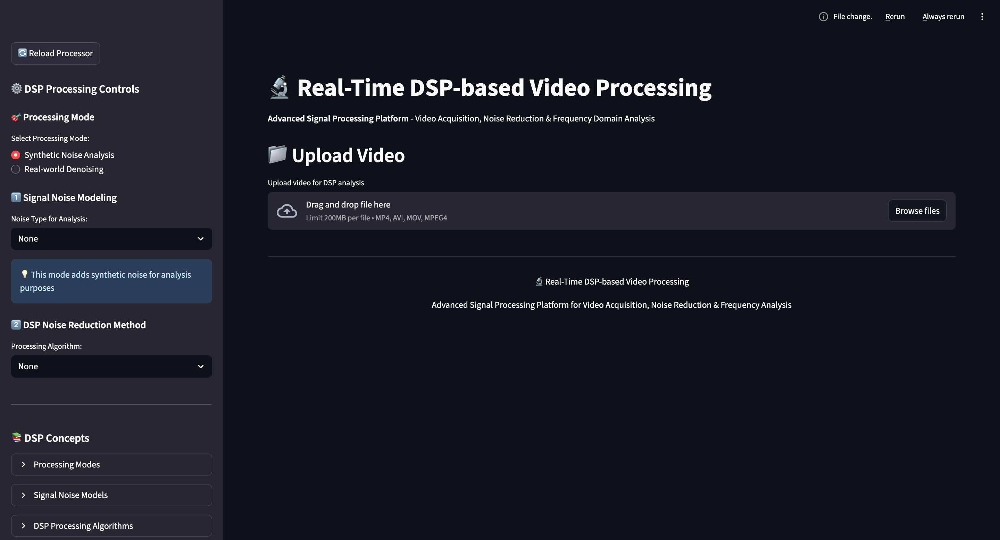

# 🎛️ Implementation of Digital Signal Processing Techniques for Real-Time Video Acquisition, Noise Reduction, and Frequency Domain Analysis

A practical digital signal processing application demonstrating video denoising techniques for educational purposes. This project combines traditional DSP filters with modern AI-based denoising methods.




## 🚀 Quick Start

```bash
# Install dependencies
pip install -r requirements.txt

# Run the application
streamlit run main.py
```

## ✨ Features

### Noise Models
- **Gaussian Noise**: Additive white noise
- **Salt & Pepper**: Impulse noise with random black/white pixels  
- **Speckle Noise**: Multiplicative noise

### DSP Filters
- **Median Filter**: Non-linear filter for impulse noise
- **Gaussian Filter**: Linear low-pass filter
- **Bilateral Filter**: Edge-preserving smoothing
- **AI Denoising**: Lightweight DnCNN model

### Analysis Tools
- **PSNR/SNR Calculation**: Quality assessment metrics
- **Frequency Spectrum**: Real-time FFT analysis
- **Before/After Comparison**: Filter effectiveness visualization
- **Interactive Parameters**: Real-time adjustment

## 📖 Usage

1. Open browser at `http://localhost:8000`
2. Upload a video file (or use the included `sample.mp4`)
3. Add noise using the sidebar controls
4. Apply filters and compare results
5. Analyze quality metrics and frequency spectrum

<i><b>Sample Video Source:</b> [YouTube](https://youtu.be/m9coOXt5nuw?si=bjF15Dj4C2OTLFRd)</i>

---
> **Note:** The AI denoising method uses an untrained model and may not work as expected.